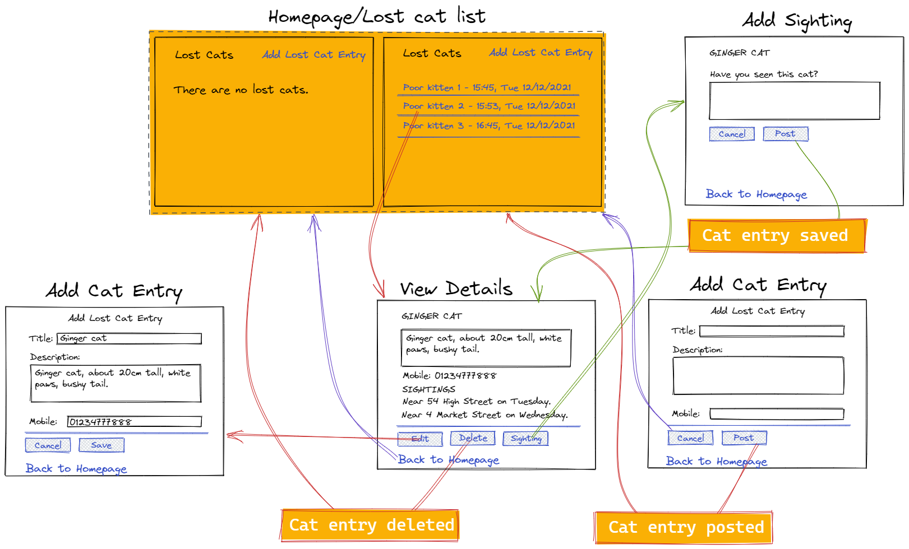

# Lost Cats Web Design Recipe (Level Two)

## 1. Describe the Problem

_Put or write the user stories here. Add any clarifying notes you might have._

> As a user
>
> So that I can find my cat that I lost
>
> I want to post an advert for a lost cat with some description of the cat, and my telephone number so people can contact me

> As a user
>
> So that I can help others find their lost cats
>
> I want to see all of the lost cat adverts

> As a user
>
> So that I can focus on the yet not-found cats
>
> I want to delete adverts for cats that have been found

> As a user
>
> So that I can update lost cat adverts with potential sightings
>
> I want to update adverts

> As a user
>
> So that I can protect my cat adverts from weird people
>
> I want to give a password with each advert, and only people who give the right password can update or delete that advert

## 2. Design the Interface

_This is the fun part! Use excalidraw.com or a similar tool to design some
wireframes (rough sketches of the user interface). Include interactions and
transitions between pages — those are the most critical part._



## 3. Design the Data Model Classes

_These classes should store and manage the data the server will hold._
_Include the initializer and public methods with all parameters and return values._

```ruby
# EXAMPLE

class CatList
  def initialize
    @cats = []
  end

  def list
    # Returns a list of lost cats
  end

  def add(lost_cat) # entry is a LostCat
    # No return value
  end

  def remove(index) # index is a number
    # Deletes the entry at index
  end

  def update(index, name, description, mobile) # index is a number, name, description & mobile are strings
    # Updates the entry at index with the new name, description and mobile
    # No return value
  end

  def get(index) # index is a number
    # Returns an entry, the entry at the given index
  def
end

# DiaryEntry class

DiaryEntry = Struct.new(:title, :description, :mobile)

```

_Check them against these rules:_

> 1. Do they represent a collection or collections of data?
> 2. Does each collection have relevant methods to:
>    1. List out all items in the resource
>    2. Create an item (C)
>    3. Get a single item (R)
>    4. Update an item (U)
>    5. Delete an item (D)
> 3. Is it possible to construct a realistic data model just by using simple
>    data types? (strings, integers, booleans)

## 4. Design the Web API (Requests)

_Design requests that perform each of the key operations on your data model._
_Map them to the methods or code snippets in your data model._

```ruby
# EXAMPLE

# INDEX
# Request: GET /lostcats
cat_list.list

# CREATE
# POST /lostcats
# With data: { title: "Ginger cat", description: "A good ginger kitten", mobile: "01234123457" }
cat = LostCat.new(title, description, mobile)
cat_list.add(cat)

# READ
# GET /lostcats/:index
cat_list.get(index)

# UPDATE
# PATCH /lostcats/:index
# With data: { title: "Ginger cat", description: "A good ginger kitten", mobile: "01234123457" }
cat = LostCat.new(title, description, mobile)
cat_list.update(index, entry)

# DELETE
# DELETE /lostcats/:index
cat_list.remove(index)
```

> Remember:
> GET: Getting a single item or a list of items
> POST: Adding an item
> PATCH: Updating an item
> DELETE: Deleting an item

## 5. Create Examples of User Interactions

_Create examples of user interactions and expectations._

```ruby
# As you learn the testing tools you might start writing with realistic test
# code here, but at the start it's OK if it's just English or made up code.

# View no entries
visit "/lostcats"
# User sees: There are no lost cats.

# Add an entry
visit "/lostcats"
click link "Add Lost Cat Entry"
enter "Ginger cat" into "Title" field
enter "A good ginger kitten." into "Description" field
enter "0123456789" into "Mobile" field
click button "Post"
# User sees the lost cat list. (homepage)


```

## 6. Test-Drive the Behaviour

_Follow this cycle:_

1. Add a feature test in `/spec/feature/` (RED)
2. Implement the behaviour in `app.rb`
3. Does it pass without data model changes? (GREEN) Then skip to step 6.
4. Otherwise, add a unit test for the data model to `/spec/unit` (RED)
5. Implement the behaviour in your data model class. (GREEN)
6. Apply any refactors to improve the structure of the code. (REFACTOR)  
   Run `rubocop` as part of this.
7. Go back to step 1.

